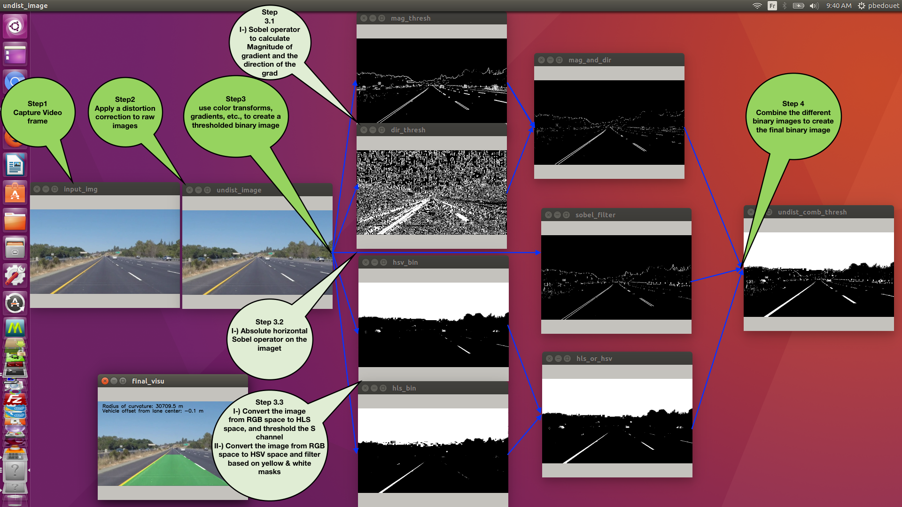
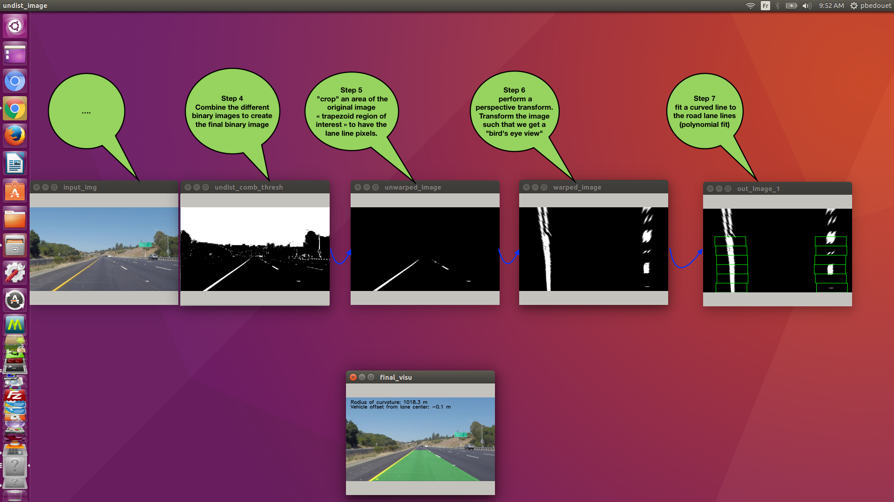
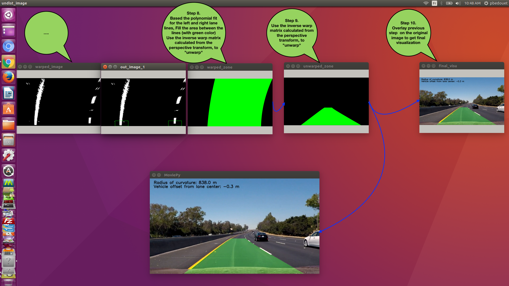
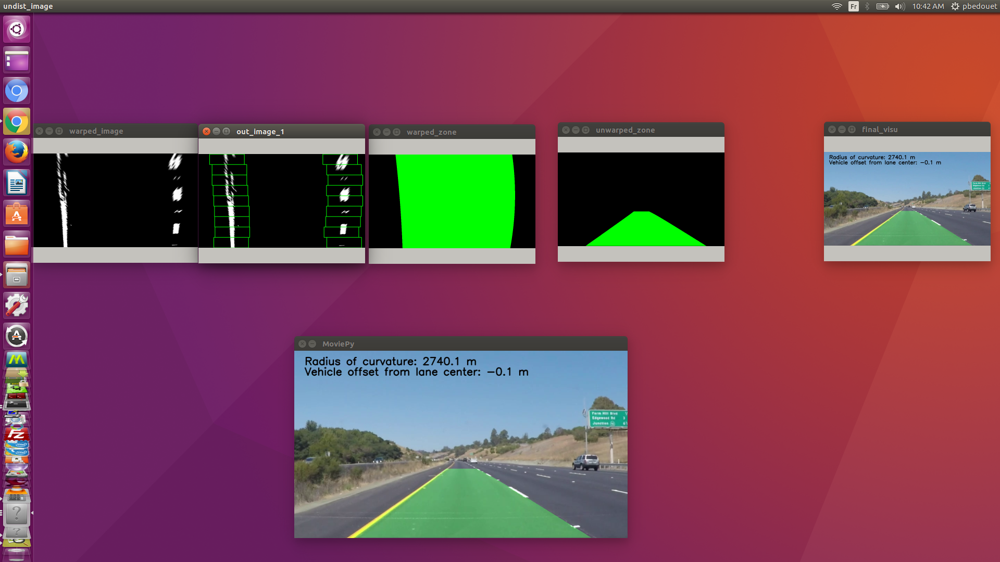
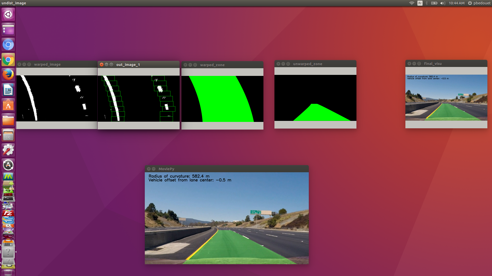

# Finding Lane Lines on the Road

This project detects lane lines using Python and OpenCV. 
A video of the end-result can be found in video_out folder

## Dependencies
* Python 3.5 / Python 2.7
* NumPy
* OpenCV
* Matplotlib
* MoviePy

## How to run
To run the script stand-alone:

```
Usage: road_lane_detector.py [options]

Options:
  -h, --help            show this help message and exit
  -i INPUT_FILE, --input_file=INPUT_FILE
                        Input video/image file
  -o OUTPUT_FILE, --output_file=OUTPUT_FILE
                        Output (destination) video/image file
  -m METHOD, --method=METHOD
                        m1 -> for method 1 - m2 -> for method 2 - m4 -> for method 4...
  -v VIDEO_MODE, --video=VIDEO_MODE
                        video_mode choice cv2 or movepi
  -P, --preview_only    preview annoted video/image
  -I, --image_only      Annotate image (defaults to annotating video)
```

For example to detect lanes lines on the video challenge.mp4 run:
method m1: hsv+canny 
method m2: combined threshold+curves 
method m3: equalizeHist+adaptiveThreshold+morphologyEx (Development on going)
method m4: caltech (Development on going)

```
python road_lane_detector.py -i video_in/challenge.mp4 -m m1 -P
python road_lane_detector.py -i video_in/challenge.mp4 -m m2 -P
python road_lane_detector.py -i video_in/challenge.mp4 -m m4 -P
```
The command above will annotate video in preview mode no output generated


To annotate and generate a video in video_out folder use the following command
```
python road_lane_detector.py -i video_in/challenge.mp4 -o video_out/challenge_annotated.mp4

```


To detect lane lines on a single image (e.g. for debugging) run:

```
python road_lane_detector.py -i image_in/input_image.jpg -o image_out/output_image.jpg -I
```


Note:
- depending on video quality please tune the white threshold value:
white_threshold 200 (change from 200 to 130) Rmember HSV values
- The trapeze size can be adjusted depending on the video position 40% vs 30% change the value:
trap_height 0.4 (change from 0.4 (40%) to 0.3 (30%) )


## Step By Step for the 2nd degree polynome fit curve







# CAMERA CALIBRATION UTILITIES 

## GPS Camera Calibration 
To calibrate the camera (For example GPS camera for race circuit) do the following step:

1-) Compute Matrix and Distorsion Coefficient run the following command
```
python calibrate_camera.py -f camera_cal/gps_cam_chess
```
The folder "camera_cal/gps_cam_chess" Contains all Chess Boards Reference Images

2-) To determine the zone of interrest for the circuit run the following command:
```
python camera_gps_roi.py -i example_images/undistort_gps_calibration.png
```
3-) To check the calibration camera parameters and circuit zone of interrest run the following checker:
```
python camera_gps_checker.py -c calibrate_gps_camera.p -r example_images/undistort_gps_calibration.tpz
```

